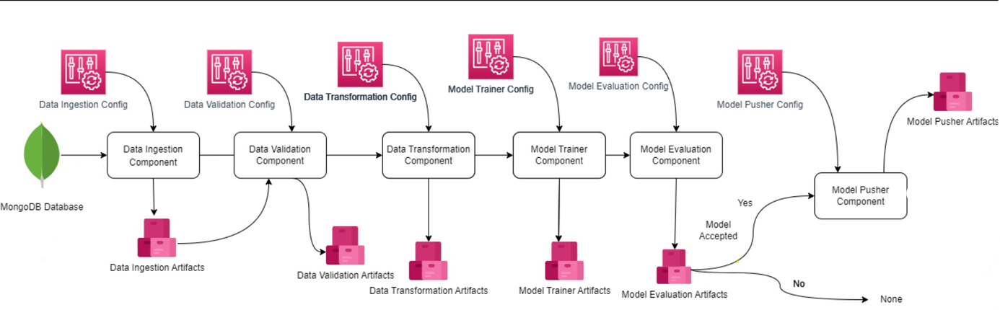

# 🛡️ Network Security ML Pipeline

This repository hosts a complete Machine Learning project dedicated to **Network Security**, specifically focusing on building an ETL (Extract, Transform, Load) pipeline for data, training a predictive ML model, and deploying it for inference.

The project follows a modular, component-based MLOps architecture to ensure reproducibility, scalability, and maintainable code.

## 🚀 Project Overview

The primary goal of this project is to analyze network data, train a machine learning model to detect anomalies or threats, and establish an automated pipeline for continuous model improvement and deployment.

### 💻 Technology Stack

* **Language:** Python
* **Database:** MongoDB (for raw data storage and retrieval)
* **Deployment:** Docker
* **ML Framework:** (Specify your ML library, e.g., Scikit-learn, PyTorch, or TensorFlow)
* **Pipeline Orchestration:** (Implicitly structured, but you can mention tools like MLflow, DVC, or Airflow if used)

---

## 📐 Architecture & Pipeline

The project is structured around a sequential Machine Learning pipeline, where each step is encapsulated in a dedicated component.



### Pipeline Components

The ML workflow is executed through a series of interconnected components:

1.  **Data Ingestion Component:**
    * **Function:** Extracts raw data from the **MongoDB Database**.
    * **Artifacts:** `Data Ingestion Artifacts` (Raw data files).
2.  **Data Validation Component:**
    * **Function:** Validates the ingested data against a predefined schema (`data_schema`). Checks for data quality, missing values, and type correctness.
    * **Artifacts:** `Data Validation Artifacts` (Validated data or reports).
3.  **Data Transformation Component:**
    * **Function:** Performs necessary ETL operations like feature engineering, scaling, encoding, and data cleaning.
    * **Artifacts:** `Data Transformation Artifacts` (Processed/ready-to-train data).
4.  **Model Trainer Component:**
    * **Function:** Trains the Machine Learning model using the transformed data and the configuration specified in the `Model Trainer Config`.
    * **Artifacts:** `Model Trainer Artifacts` (Trained model, training metrics).
5.  **Model Evaluation Component:**
    * **Function:** Evaluates the trained model's performance against a baseline or a previous production model.
    * **Artifacts:** `Model Evaluation Artifacts` (Evaluation metrics, model acceptance status).
6.  **Model Pusher Component:**
    * **Function:** If the model is **Accepted** (performance meets the threshold), this component pushes the new model to a production deployment environment.
    * **Artifacts:** `Model Pusher Artifacts` (Production-ready model files).


---

## 📦 Project Structure

The repository layout is designed for clarity and MLOps compliance:

| Directory/File | Purpose |
| :--- | :--- |
| `__pycache__` | Python's compiled bytecode cache (ignored by Git) |
| `.github/workflows/main.yaml` | **CI/CD Pipeline** configuration (e.g., for GitHub Actions). |
| `Artifacts/` | Storage for pipeline outputs, including intermediate and final results. |
| `data_schema/` | Defines the structure and constraints for input data validation. |
| `final_model/` | Stores the final, production-ready ML model. |
| `Images/` | Contains project-related images (like the pipeline diagram). |
| `Network_Data/` | Likely stores small samples or processed data for testing/quick start. |
| `networksecurity/` | The **main source code** package containing all modular components (Ingestion, Trainer, etc.). |
| `notebooks/` | Exploratory Data Analysis (EDA) and initial model prototyping notebooks. |
| `templates/` | Stores templates for the web application (if an application is used for inference). |
| `venv/` | The isolated Python **virtual environment**. |
| `.env` | Environment variables for sensitive configuration (e.g., DB credentials). |
| `app.py` | Main entry point for the **web application/API** (likely using Flask/Streamlit). |
| `Dockerfile` | Defines the environment for **containerized deployment**. |
| `main.py` | Main entry point for **running the ML pipeline**. |
| `README.md` | This file, providing an overview and instructions. |
| `requirements.txt` | Lists all necessary Python dependencies. |
| `setup.py` | Used for packaging the `networksecurity` code as an installable Python library. |
| `test_mongodb.py` | Utility file for testing connectivity to the MongoDB database. |

---

## 🛠️ Setup and Installation

### 1. Clone the Repository

```bash
git clone <repository_url>
cd NETWORK_SECURITY